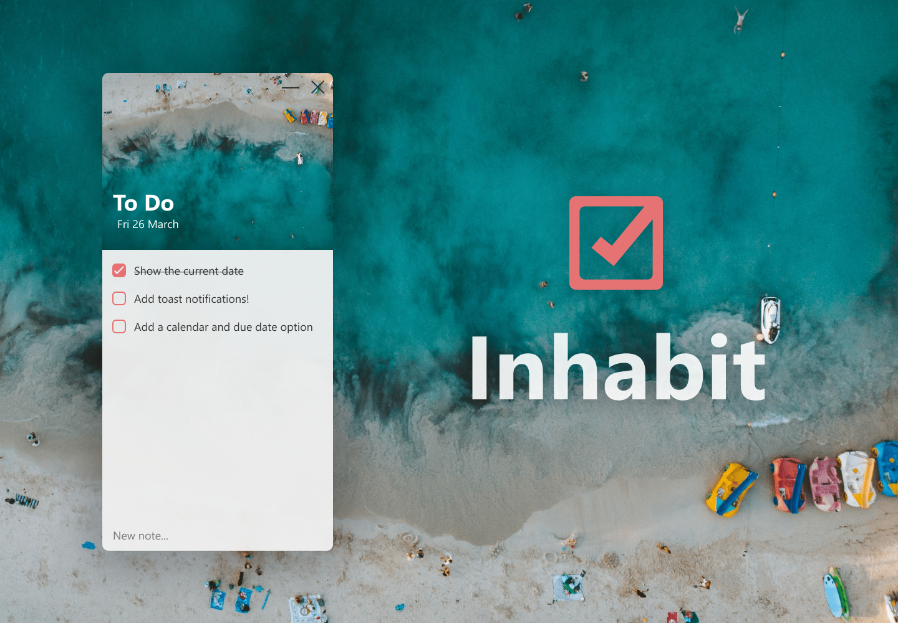

    
    
    <a href="https://github.com/nathanlytang/inhabit" alt="Language">
            

#  Inhabit

A simple to-do list desktop application built in HTML/CSS/JS using the Electron framework.

### Usage

* Development: Clone the repository then `npm install` then `npm start`
* Production: Download the <a href="https://github.com/nathanlytang/inhabit/releases/latest" >latest release</a> from the repository and install.

